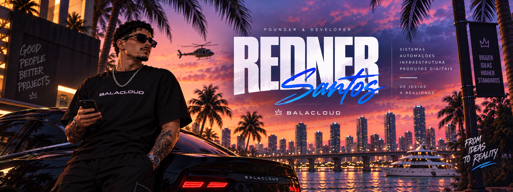

  

# Redner Santos

### Founder & Developer @ BalaCloud

Construindo sistemas, automações, infraestrutura e produtos digitais.

---

## Sobre mim

Sou fundador e desenvolvedor da **BalaCloud**.

Trabalho na construção de sistemas, aplicações web, automações, infraestrutura e produtos digitais voltados para resolver necessidades reais de projetos, comunidades e operações online.

Meu foco é desenvolver soluções que sejam simples para quem usa, mas robustas por trás.

Hoje trabalho principalmente com desenvolvimento web, arquitetura de sistemas, automação, infraestrutura e integração de serviços.

---

## BalaCloud

A **BalaCloud** é onde transformo ideias em produtos e sistemas reais.

O objetivo não é simplesmente entregar uma ferramenta pronta, mas construir soluções que façam sentido para cada projeto.

Entre as áreas em que trabalhamos estão:

- Aplicações web
- Bots e automações
- Sistemas para Discord
- Infraestrutura
- Painéis administrativos
- Integrações
- Produtos digitais
- Ferramentas para comunidades online

### From Ideas to Reality.

---

## Tecnologias

---

## Atualmente construindo

### BalaCloud Panel V3

A nova geração da plataforma de gerenciamento da BalaCloud.

O projeto está sendo desenvolvido como um ecossistema central capaz de gerenciar diferentes produtos, módulos, clientes, instâncias e aplicações.

Algumas das áreas do projeto:

- Gestão de clientes
- Produtos e módulos
- Bots e aplicações
- Instâncias independentes
- Sistema de tickets
- Histórico e transcripts
- Controle de permissões
- RBAC
- Configurações centralizadas
- Biblioteca de assets e emojis
- Integrações com Discord
- Estrutura multi-instância

---

### RodaFlux

Plataforma de gestão financeira e operacional voltada para motoristas de aplicativo.

O RodaFlux foi pensado para reunir em uma única experiência tudo o que normalmente fica espalhado entre anotações, planilhas e aplicativos diferentes.

Entre os recursos:

- Jornadas de trabalho
- Ganhos
- Gastos
- Combustível
- Quilometragem
- Consumo
- Manutenção
- Metas
- Calendário
- Projeções financeiras
- Relatórios
- Controle de veículos

---

## Como eu penso produto

Não gosto de construir sistemas apenas para preencher uma lista de funcionalidades.

Prefiro pensar em como a pessoa realmente vai utilizar aquilo no dia a dia.

Isso significa trabalhar bastante em:

- Experiência do usuário
- Arquitetura
- Simplicidade
- Escalabilidade
- Automação
- Organização
- Manutenibilidade
- Segurança
- Performance

A tecnologia pode ser complexa por trás.

Para quem usa, ela não precisa ser.

---

## GitHub

### Construindo, evoluindo e colocando ideias em produção.

Meus principais projetos atualmente estão concentrados no ecossistema da **BalaCloud** e no desenvolvimento do **RodaFlux**.

---

## Contato

---

### REDNER SANTOS

**Founder & Developer @ BalaCloud**

Construindo ideias. Desenvolvendo sistemas. Criando produtos.

